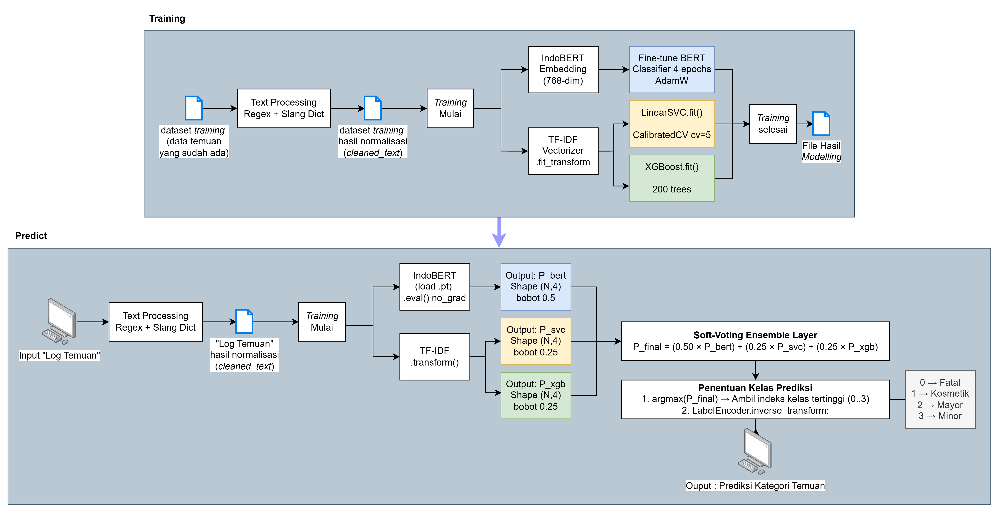

# Auto-Severity Classification Pipeline

Pipeline klasifikasi otomatis tingkat keparahan temuan/bug dari teks "Log Temuan" tester pada sistem **Web Simata**.

## Deskripsi

Sistem ini memproses teks mentah dari tester, melatih tiga model klasifikasi secara paralel, lalu menggabungkan hasilnya melalui soft-voting ensemble untuk memprediksi label severity: **Fatal**, **Mayor**, **Minor**, atau **Kosmetik**.

## System Flow



## Struktur Proyek

```
implement-automation/
├── data/
│   ├── raw/                    # CSV mentah (train_data.csv, test_data.csv)
│   ├── processed/              # Output preprocessing (*_cleaned.csv, *_embeddings.npy)
│   ├── output/                 # Hasil prediksi (test_prediction.csv)
│   ├── dictionaries/           # kamus_slang.csv, id_freq_dict.txt
│   └── test/                   # Folder eksperimen
├── models/                     # Artifact model tersimpan
│   ├── indobert_severity.pt
│   ├── tfidf_vectorizer.pkl
│   ├── linearsvc_model.pkl
│   ├── xgboost_model.pkl
│   ├── label_encoder.pkl
│   └── ensemble_config.json
├── preprocessing/
│   ├── __init__.py
│   ├── pipeline.py             # Orchestrator preprocessing (2 tahap)
│   ├── text_cleaner.py         # Tahap 1: Regex cleaning (10 sub-step)
│   ├── slang_normalizer.py     # Normalisasi slang Bahasa Indonesia
│   └── feature_extractor.py   # Tahap 2: IndoBERT embedding
├── notebooks/
│   └── 03_model_training.ipynb
├── main.py                     # CLI entry point
├── trainer.py                  # Training & evaluasi ketiga model
├── config.py                   # Konfigurasi global (path, parameter)
└── requirements.txt
```

## Instalasi

```bash
pip install -r requirements.txt
```

## Penggunaan

Jalankan pipeline melalui CLI:

```bash
python main.py
```

Muncul menu:

```
[1] Upload file CSV baru (Train + Test)
[2] Gunakan data yang sudah ada (langsung training)
[0] Keluar
```

- Pilih `[1]` untuk upload `train_data.csv` dan `test_data.csv` baru via file dialog, lalu preprocessing otomatis dijalankan sebelum training.
- Pilih `[2]` jika data di `data/processed/` sudah ada, langsung lanjut ke training.

### Format CSV yang dibutuhkan

| Kolom | Keterangan |
|---|---|
| `Log Temuan` | Teks bug report mentah dari tester (wajib) |
| `Kategori` | Label severity (wajib di train, opsional di test) |

### Penggunaan sebagai library

```python
from preprocessing import PreprocessingPipeline

pipeline = PreprocessingPipeline()

# Proses satu teks
result = pipeline.preprocess_text("1)tombolSimpan error500 tdk berfungsi")
print(result)
# → "tombol simpan error 500 tidak berfungsi"

# Proses CSV langsung
result_df = pipeline.preprocess_csv(
    input_path="data/raw/train_data.csv",
    output_path="data/processed/train_cleaned.csv"
)
```

## Konfigurasi

Edit `config.py` untuk mengatur:

| Parameter | Default | Keterangan |
|---|---|---|
| `INDOBERT_MODEL_NAME` | `indobenchmark/indobert-base-p1` | Model HuggingFace yang digunakan |
| `INDOBERT_MAX_LENGTH` | `128` | Panjang maksimum token |
| `INDOBERT_BATCH_SIZE` | `32` | Ukuran batch saat embedding |
| `INPUT_COLUMN` | `Log Temuan` | Nama kolom teks input |
| `LABEL_COLUMN` | `Kategori` | Nama kolom label |
| `PIPELINE_STAGES` | keduanya `True` | Toggle aktif/nonaktif tiap tahap |

## Teknologi

| Komponen | Library | Peran |
|---|---|---|
| Text Cleaning | `re` (built-in) | 10 sub-tahap regex: HTML preservation, CamelCase splitting, URL removal, dll |
| Slang Normalization | `pandas`, `dict` | Hash map O(1) lookup dari `kamus_slang.csv` |
| Feature Extraction | `transformers`, `torch` | IndoBERT encoder — menghasilkan embedding 768-dim per teks |
| BERT Classifier | `transformers`, `torch` | Fine-tuned classification head, 4 epoch, AdamW + LinearWarmup |
| TF-IDF | `scikit-learn` | Unigram + bigram vectorizer, 10.000 fitur, sublinear TF |
| LinearSVC | `scikit-learn` | SVM linear dengan `CalibratedClassifierCV` (cv=5) untuk probabilitas |
| XGBoost | `xgboost` | Gradient Boosted Trees, 200 estimator |
| Ensemble | `numpy` | Soft-voting dengan bobot 0.5 / 0.25 / 0.25 |

## Output

Hasil prediksi disimpan di `data/output/test_prediction.csv`:

| Kolom | Isi |
|---|---|
| `Log Temuan` | Teks asli dari tester |
| `Kategori` | Label prediksi: Fatal / Mayor / Minor / Kosmetik |
| `cleaned_text` | Teks setelah preprocessing |

Model artifact tersimpan di `models/` dan dapat digunakan kembali tanpa training ulang.
